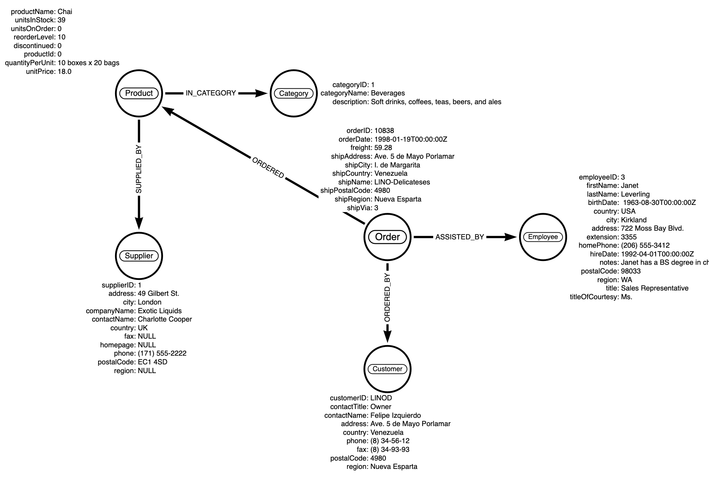
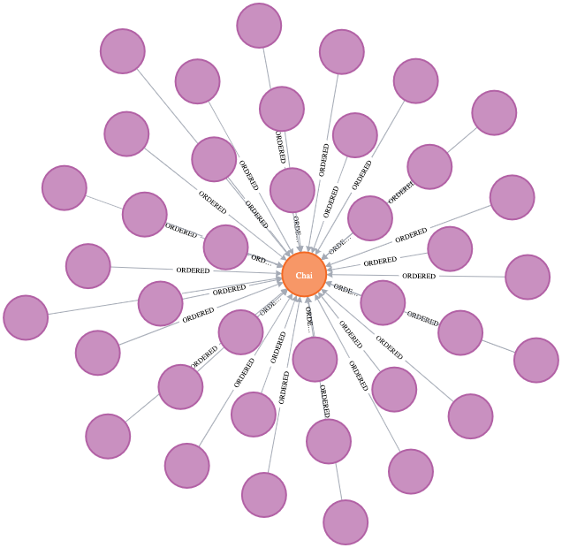
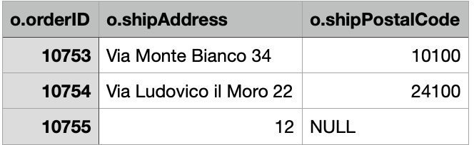
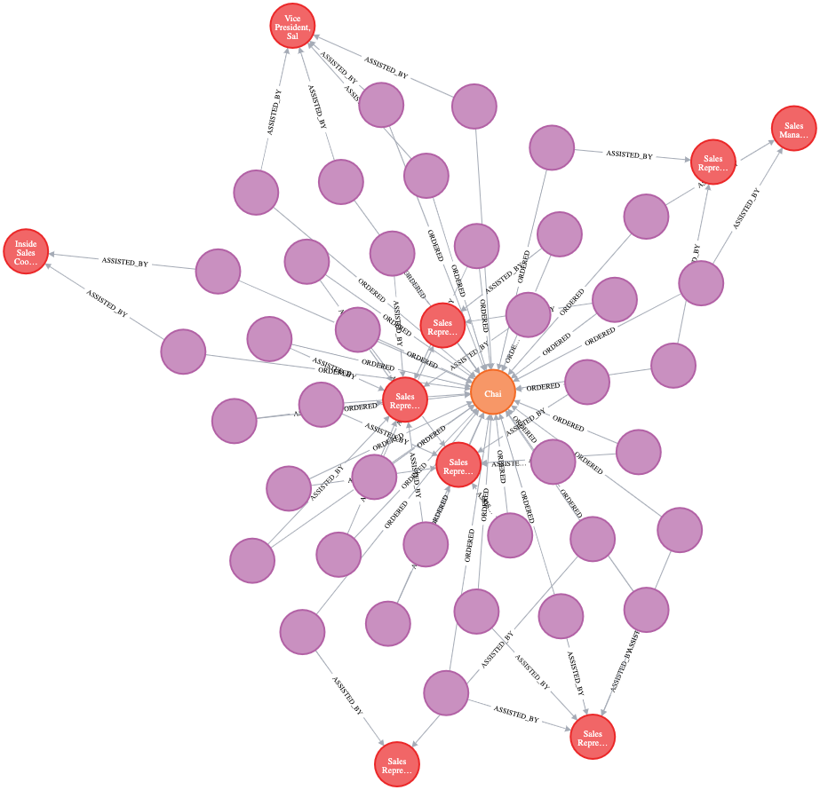
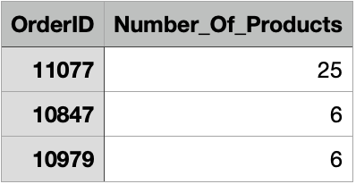

## Setup instructions
1. Install Python 3
2. Install python package requirements
    `pip3 install -r requirements.txt`
3. Install Docker Desktop
4. Clone this repo into `~/repos/` folder. You should now have your repo folder living here at `~/repos/neo4j_exercise`
5. Run neo4j Docker container using
    ```bash
    docker run -p 7474:7474 -p 7687:7687 \
      --volume=$HOME/repos/neo4j_exercise/data:/data \
      --volume=$HOME/repos/neo4j_exercise/raw_data:/var/lib/neo4j/import \
      --env NEO4JLABS_PLUGINS='["apoc", "graph-data-science"]' \
      --env apoc.import.file.enabled=true \
      --env NEO4J_AUTH=neo4j/1234 \
      neo4j:latest
    ```
    Note: Ensure that the `--volume` paths point to where you cloned the repo
6. Open neo4j browser by pointing your browser to `localhost:7474`


## Data model / graph
The data model / graph used in this project is as shown in below image.



## Running data ingestion
> **_NOTE:_** The source data includes errors which I have not corrected as part of this exercise. The errors are due to the field seperators (`,`) being present inside some of the fields. This causes some rows to be imported incorrectly.

The repo contains 2 relevant files:
* [RetailAnalysis.py](RetailAnalysis.md)
  Contains a class called `RetailAnalysis`, which includes methods to imnport each node and the relationships between them from the CSV data located in `noe4j_exercise/data/raw_data/`
* [ingest_data.py](ingest_data.md)
  File to run in order to perform data ingestion and build the data graph

In order to run the ingestion, run the following command from within the `neo4j_exercise` folder:
```bash
python3 ./ingest_data.py
```


## Running queries against data graph
Go to `localhost:7474` using your browser and you should see the neo4j browser load.

A few queries against the data graph:

1. Which orders have included the product with productID=1 (Chai)?
    Run the following Cypher query:
    ```
    MATCH (o:Order),(p:Product)
    WHERE p.productID=1
    RETURN (o)-[*]->(p)
    ```
    You should see the following graph returned
    

    It's also possible to return a list of some of the property values instead of the graph diagram
    ```
    MATCH (o:Order),(p:Product)
    WHERE p.productID=1
    RETURN 
        o.orderID,
        o.shipAddress,
        o.shipPostalCode
    LIMIT 3
    ```
    

2. Which employees assisted with orders placed that included product `Chai`?
    ```
    MATCH (e:Employee)<-[:ASSISTED_BY]-(o:Order)-[:ORDERED]->(p:Product)
    WHERE p.productID=1
    RETURN (e)<-[*]-(o)-[*]->(p)
    ```
    

3. Which order contained the highest number of products?
    ```
    MATCH (o:Order)-[:ORDERED]->(p:Product)
    RETURN 
        o.orderID AS OrderID,
        count(p) AS Number_Of_Products
    ORDER BY count(p) DESC
    LIMIT 3
    ```
    
    We can see that order with orderID number 11077 contained 25 products, which was the highest number.